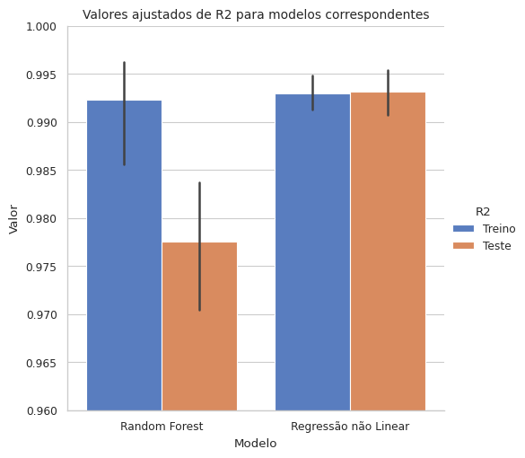
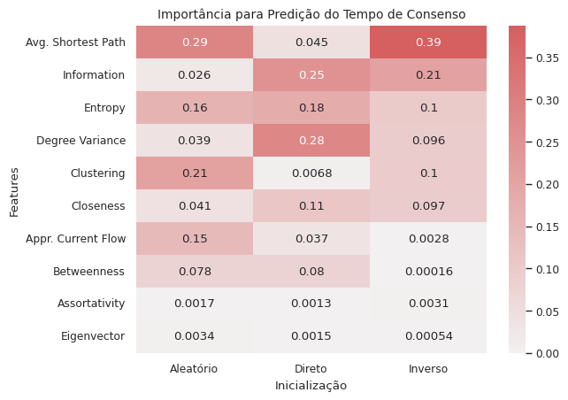
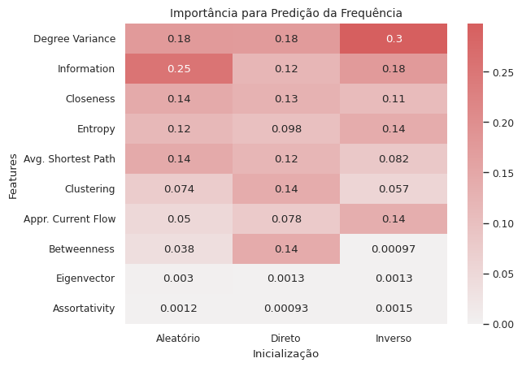

# Introduction
The interaction between simple ruled components of a system can create complex patterns and features like emergence, scale-free distributions and heterogeinity. Emerging phenomena are present in complex systems and characterized by the spontaneous result of the interaction between millions of components that constitute the system. An big example of emergence occours during asian southeast night, when fireflies from all over the region adjust its blinking frequency accordingly to their neighbors. The effect is expanded past the whole system until they all blink in synchrony [@johnson2002emergence].   

In the context of social dynamics, mathematical models that seek to reproduce human behaviour in networks, emergency can be characterized as an phenomena related to polarization [@maia2021emergence]. Here, we define polarization as the opinion fragmentation, a state opposed to consensus. Many studies show that polarization can have deep influence in political environment, as seen in violent and anti-democratic rallies that took place in January 8th 2023 at Brasilia [@interian2023polarization;@layton2021polarization]. Given this, is very important to study polarization aiming to reduce discord scenarios.

Statistical physics developed tools for the study of many interacting particle systems, which are adopted with ease by social dynamics academics. Ersnt Ising found the exact solution for a paramagnetic model, in which magnetic materials that can reach two symmetric states and seek a low energy configuration. The model received Ising name and can be considered as an first attempt to binary Opinion models, where a transition appears between polarization and consensus. Sznajd model was inspired by Ising and aims to explore how similar opinions are necessary to influence others. On the otherside, the Voter model explore how order emerges with different influence group sizes.

For a better compreehension of consensus phenomena, it is important to simulate those models in different network topologies, since they have deep influence in dynamics and resulting polarization. Recent studies highlight the significant influence of topology in consensus results and polarization [@pineda2023machine]. Given this, arises the necessity of investigate a Machine Learning model to predict dynamic variables of a complex system based on the underlying network. This approach, widely applied in synchronization and epidemic disease spreading [@rodrigues2019machine], raises the quesion about its applicability in the Sznajd model. 

Here, we look into this possibility, focusing on the machine learning capability of antecipating the associated dynamical variables through topological features. Stands out, the potencial of this analysis for the understanding of dynamical systems, providing valuable insights about emergence and evolution of polarization in society. Given the high collinearity between characterization measures, a methodology based on Forward Selection and Non-Linear Regression was proposed, granting assuring high accuracy, robustness and explainability when compared to previously used Random Forests.

# Methods

## Random networks
Six different topologies were analyzed: Erdös–Rényi, Barabási–Albert linear, Barabási–Albert non-linear with $\alpha=0.5$ and $\alpha=1.5$, Watts–Strogatz e Waxman [@boccaletti2006complex;@costa2007characterization]. This networks adress different structures that real society can admit, considering the presence of hubs, communities and small-world. As networks generated by those models have different properties, we can create a diverse database. Therefore, the effects of topological properties in the underlying dynamical process can be verified, given that lots of properties, such as average shortest path lenght and closeness centrality will vary according to each new graph. This diversity will help the Machine Learning model to generalize. For each random network model, a 100 instances were created to diminish effects of randomness. 

## Network characterization \label{characterization}

We characterize each network $i$ from its structure and denoted by $X_i=\{X_{i1}, X_{i2}, ...,X_{ik}\}$, where $X_{ik}$ is the *k-th* metric of the network $i$. A wide variety of metrics were used, including Average Clustering Coefficient, Average Closeness Centrality, Average Betweenness Centrality, Average Shortest Path Lenght, Pearson Degree Correlation Coefficient, Average Information Centrality, Average Approximate Current Flow Betweenness Centrality and Eigenvector Centrality, Shannon Entropy and Degree Variance. These measures provide valuable insights about topology, connectivity, efficiency, influence and organization in complex networks [@costa2007characterization].

## Sznajd model simulation

The understanding of transitions from disordered states to order can are represented in traditional statistical mechanics by the Ising paradigm [@castellano2009social]. The Sznajd model [@sznajd2000opinion] was proposed as an adaptation of the Ising model to describe opinion dynamics in a society. 

The original model follows an stochastic simulation implementing the social validation on agents $S_i, i=1,2,...,N$ with opinions $O=\{-1, +1\}$. The original model was proposed to an one-dimensional systems. Altough, the dynamics were adapted to include complex networks in [@sanchez2004sznajd], and this work consider the Sznajd model from [@Bernardes_2002] for binary opinion dynamics. 

Consider a network of $N$ agents, with opinions $O =\{-1, +1\}$ distributed randomly. Each agent is a dynamic variable $s(x, t)=O$ with degree $k_x$, where $x=1,...,N$. The system runs through iterations $t$ until consensus as described below:

- Two neighbors $i$ and $j$ are chosen at random;
- If $s(i, t) \ne s(j, t)$, nothing happens;
- If $s(i, t) = s(j, t)$, all neighbors of $i$ and $j$ receive the opinion $s(i, t)$.

### Dynamical variables
The consensus time, defined as the period required for the system to reach a steady state, is a crucial metric in the analysis of consensus dynamics, as well as the frequency of opinion exchange. During the simulation, we recorded both the consensus time and the frequency of opinion exchange as key indicators of the system's behavior.

### Node initialization

The parameters for the networks and the model were fixed to provide a concise baseline during the tests with the machine learning algorithms. By fixing these parameters, it is possible to focus on the impact of other variables in the analysis. Thus, the simulations will feature networks with a fixed number of nodes, specifically $N=1000$, as well as a percentage of nodes with positive opinions set to $p=0.2$.

Additionally, we adopted three distinct initialization approaches for the nodes with positive opinions in the simulations. First, random initialization, assigning positive opinions to nodes randomly. Next, we used the inverse initialization strategy, where nodes with the lowest degree receive positive opinions. Finally, we applied direct initialization, where the most influential nodes in the network receive positive opinions. It is of utmost importance to simulate the system with different initializations, enabling us to analyze how the importance of features is influenced in each case and to better understand how consensus situations can be favored.

## Machine learning
Our hypothesis is that consensus time $Y_i$ and opinion change frequency $C_i$ can be inferred from network features $X_i$.

$$
Y_i = f(X_i)+\delta.
$$

Generalizing for $Y_i$ above, we aim to find a function $f$ that relates $Y_i$ to network metrics. We then treat it as a regression problem where $\delta ~ N(0,\sigma)$, this is, uncertainty in data, fluctuations in simulation and models.

### Adjusted R2
To assure model quality, the adjusted R2 metric will be used. It measures how well observed outcomes are replicated by the model and takes into account the number of variables used, penalizing the inclusion of those who are irrelevant. In the formula below, $n$ indicates the number of samples in the test set:

$$
R^2_\text{adj} = 1 - \dfrac{(1 - R^2) (n - 1)}{(n - p - 1)}
$$

### Forward Selection (FS)
Forward Stepwise Selection its a efficient way of selecting features. It starts with an model without features and adds one by one until the number of required variables are completed. Particulary, in each step the best predictor is added to the model. Considering high colinearity between variables, FS has an essential role of selecting the best one without discarding correlations [@isl2014james].

### Cross-Validation (CV)
To analyze results, the model was evaluated in a cross-validation environment. CV divides training set in $k$ folds of equal size. In each iteration $i=1,...,k$, all folds except the $i$-th fold are considered as training samples, and tested on the remaining fold. This step garantees the model is capable of generalizing and making prediction on unseen data. The tests considered $k=10$ folds.

CV was also performed during Feature Selection, in order to assure results are consistent within different iterations. The two most frequent features after $k$ iterations were selected.

### Non-Linear Regression
Non-Linear regression is well suited for cases where response variable is not a linear combination of features and can be performed through a non-linear transform [@isl2014james]. Here, we use a logarithm transform to estimate coefficients $\beta_1,...,\beta_p$ such that 

$$
\log(Y) = X\beta+\delta
$$

or

$$
Y = e^{X\beta+\delta}
$$

The exponential function image is $(0,\infty)$, which is appropriate for our context since response variables (consensus time and opinion change frequency) are always positive. 

### Data Standardization
As a way of performing regression analysis, it is important to assure data is standardized, with the objective of prevent inaccurate coefficients and help determining which values have major importance. The process occours after logarithm transformation and is shown below:

$$
X_{\text{std}}=\dfrac{X-\mu}{\sigma}
$$

### Random Forests
Robust machine learning models for tabular data involve the ensemble of decision trees, where the final response is an average of each tree. Among these models, Random Forests gained popularity by proposing the construction of trees through bootstrap aggregation or bagging. At each step, a tree is trained from a dataset obtained by sampling with replacement from the training set. After a large number of trees are generated, a new sample is predicted based on the average values of all the trees [@breiman2001random].

# Results
## Prediction of Dynamical Variables
Figure \ref{compare} presents a boxplot with Random Forest and Non-Linear Regression models for the prediction of dynamical variables. It is possible to see that both models learn correctly, but the latter one reaches better generalization. Notably, it also presents simpler training and better explainability. Thus, together with FS, it presents as a robust method for topological analysis.

{ height=300px }

## Random Forests Feature Importance
An analysis of the most important features was conducted for both response variables and different initialization methods, demarcated according to the colors. The features are ordered in descending order in the graph by average importance. It is important to note the dilution of feature importance in the Consensus Time, where there is a significant distinction in importance for each initialization method (Figure \ref{consensus_importance}). In contrast, for the Opinion Exchange Frequency, the variance of the degree is dominant across all initializations. On the other hand, Eigenvector and Assortativity show no predictive capability (Figure \ref{consensus_importance}). In all cases, it is not clear which metrics are decisive for predicting the response variables, reinforcing the importance of feature selection in this scenario.

{ height=356px }

{ height=356px }

## Regression analysis
Least squares regression methods allow us to delve deeper into the results for greater interpretability of the response variables through regression coefficients, p-values, and other information [@murphy2012machine]. Here, we performed an empirical selection of the variables from section \ref{characterization}, prioritizing diversity and explainability. Thus, the following results stem from the same scenario as the previous subsection, considering only the variables described in section \ref{characterization}: Shannon Entropy, Assortativity, Average Closeness Centrality, and the Clustering Coefficient.

# Conclusion
## Compared to the last related published paper, this one presents a more robust method
## Analysis of the coeficients (we cant tell that much, but here they are)
## Future works: how can we adapt traditional learning methods to the node prediction, given that we expect a iid assumption 

# Referências #
::: {#refs}
:::

\newpage

\appendix
# Appendix
## Non-linear regression results \label{appendix}
### Consensus Time
**Random Initialization:** Adj. R2: 0.988

|            |   Coef |   p-valor |   Std. error |
|:-----------|-------:|----------:|-------------:|
| const      |  5.937 |         0 |        0.004 |
| clustering |  0.73  |         0 |        0.009 |
| closeness  | -0.111 |         0 |        0.009 |

**Direct Initialization:** Adj. R2: 0.993

|            |   Coef |   p-valor |   Std. error |
|:-----------|-------:|----------:|-------------:|
| const      |  6.023 |         0 |        0.006 |
| clustering |  1.265 |         0 |        0.011 |
| closeness  | -0.121 |         0 |        0.011 |

**Reverse Initialization:** Adj. R2: 0.993

|            |   Coef |   p-valor |   Std. error |
|:-----------|-------:|----------:|-------------:|
| const      |  6.48  |         0 |        0.004 |
| clustering |  1.222 |         0 |        0.009 |
| closeness  |  0.082 |         0 |        0.009 |

### Opinion Change Frequency

**Random Initialization:** Adj. R2: 0.993

|            |   Coef |   p-valor |   Std. error |
|:-----------|-------:|----------:|-------------:|
| const      |  6.626 |         0 |        0.006 |
| clustering |  0.316 |         0 |        0.012 |
| closeness  | -1.265 |         0 |        0.012 |

**Direct Initialization:** Adj. R2: 0.991

|                 |   Coef |   p-valor |   Std. error |
|:----------------|-------:|----------:|-------------:|
| const           |  6.793 |         0 |        0.01  |
| closeness       | -2.271 |         0 |        0.013 |
| shannon_entropy |  0.146 |         0 |        0.013 |

**Reverse Initialization:** Adj. R2: 0.997

|            |   Coef |   p-valor |   Std. error |
|:-----------|-------:|----------:|-------------:|
| const      |  6.606 |         0 |        0.005 |
| clustering |  1.208 |         0 |        0.01  |
| closeness  | -0.835 |         0 |        0.01  |
