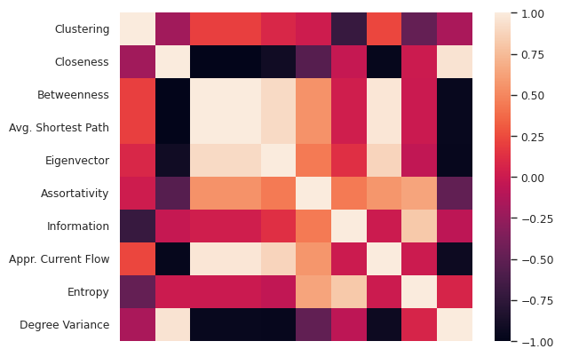

# Introdução
A interação entre componentes de um sistema que possuem regras simples leva a formação de padrões complexos e características como emergência, livre de escala e heterogeneidade. Fenômenos emergentes são presentes em sistemas complexos e caracterizados pelo resultado espontâneo da interação entre os milhares de componentes que constituem o sistema. Um grande exemplo de emergência ocorre durante a noite do sudeste asiático, quando vagalumes da região piscam de acordo ajustam a frequência do piscar de suas luzes de acordo com os vizinhos mais próximos, até que o efeito seja extendido por todo o sistema, de forma que os indivíduos pisquem em sincronia \cite{johnson2002emergence}.

No contexto de dinâmicas sociais, isto é, modelos matemáticos que buscam reproduzir o comportamento humano em redes, a emergência pode ser caracterizada como um fenômeno relacionado a polarização \cite{maia2021emergence}. Aqui e no restante do relatório, definimos polarização como a fragmentação de opiniões, um estado contrário ao consenso. Diversos estudos mostram que a polarização pode ter profunda influência no âmbito político, como visto nas manifestações anti-democráticas e violentas ocorridas em Brasília no dia 8 de Janeiro de 2023 \cite{interian2023polarization,layton2021polarization}. Dessa forma, é de suma importância estudar a polarização para evitar que cenários de discórdia se repitam.

A física estatística desenvolveu ferramentas para o estudo de sistemas de muitas partículas interagentes, os quais são adaptados com facilidade para o estudo de dinâmicas sociais. Ersnt Ising encontrou a solução exata para um modelo de paramagneto, representando materiais que podem alcançar dois estados conflitantes e buscam um estado de mínima energia. O modelo recebeu o nome de Ising e pode ser considerado como um modelo para simples opiniões, onde há uma transição de fase entre os estados de polarização e consenso. O modelo de Sznajd foi inspirado pelo primeiro modelo e busca explorar como opiniões semelhantes são necessárias para influenciar outros. Já o modelo votante ilustra como a maioria pode influenciar vizinhos, explorando por sua vez como a ordem emerge a partir da opinião maioria.

Para uma compreensão mais realista do fenômeno do consenso, é crucial simular esses modelos em diferentes topologias de rede, uma vez que ela desempenha um papel fundamental na dinâmica do consenso e na polarização resultante. Estudos recentes destacam a influência significativa da topologia da rede nos resultados de consenso e polarização \cite{pineda2023machine}. Dada a significativa influência da topologia da rede na formação de consenso, surge a necessidade de explorar a viabilidade de um modelo de Aprendizado de Máquina para prever variáveis dinâmicas de sistemas com base nas propriedades de rede subjacente. Essa abordagem, amplamente aplicada em campos como sincronização e disseminação de epidemias \cite{rodrigues2019machine}, levanta a questão sobre sua aplicabilidade no estudo do modelo de Sznajd. Este trabalho investiga essa possibilidade, focalizando na capacidade do aprendizado de máquina de antecipar variáveis dinâmicas do modelo de Sznajd, com base na topologia da rede. Destaca-se assim, o potencial dessas análises de rede para a compreensão de sistemas dinâmicos, fornecendo \textit{insights} valiosos sobre a emergência e evolução da polarização na sociedade.

Esse trabalho apresenta valiosos *insights* na relação entre topologia de rede e dinâmicas sociais, destacando o potencial do uso de métricas de rede para análise de sistemas dinâmicos. Visto a alta colinearidade nas métricas de caracterização \ref{figure:2} e comportamento das variáveis resposta, uma metodologia baseada em *Forward Selection* e Regressão não Linear foi proposta, garantindo alta acurácia, robustez e maior explicabilidade em relação a *Random Forests*.

<!-- 
- topologia pode influenciar na formação de consenso, além disso seria ótimo estudar sistemas complexos com ferramentas como ML
- alguns resultados com o modelo de sznajd
- vamos comparar diferentes abordagens e dinâmicas 
-->

# Materiais e Métodos
## Geração de Redes Aleatórias
Seis diferentes topologias das redes foram examinadas. As redes Erdös–Rényi, Barabási–Albert linear, Barabási–Albert não linear com $\alpha=0.5$ and $\alpha=1.5$, Watts–Strogatz e Waxman ~\cite{boccaletti2006complex,costa2007characterization}. Essas topologias buscam abordar diferentes estruturas que sociedades reais possam admitir, considerando a presença de hubs, comunidades e *small-world*. Ou seja, como as redes geradas por esses modelos apresentam diferentes propriedades que podems ser controladas através de seus parâmetros, poderemos gerar um banco de dados com exemplos de topologias diferentes. Assim, os efeitos de propriedades topológicas no processo dinâmico podem ser verificados, visto que muitas propriedades, como distância entre os vértices ou nível de centralidade, sofrerão variações nas bases geradas. Essa variação é importante para oferecermos exemplos diferentes aos modelos de aprendizado que usaremos na fase de predição das variáveis dinâmicas. Para cada uma dessas redes, 100 instâncias foram criadas visando diminuir efeitos da aleatoriedade na construção do modelo.

### Erdos-Renyi (ER)
O modelo de Erdos-Renyi (ER) é um dos mais estudados e detalhados na teoria dos grafos. É formado ao ligar $N$ nós entre as possíveis arestas com probabilidade $p$. Apesar de não representar com fidelidade cenários do mundo real, possui apelo matemático por possuir características bem definidas. 

### Small-World de Watts e Strogatz
Diversas redes do mundo real exibem a propriedade *small-world*, isto é, a maioria dos vértices podem ser alcançados pelo restante a partir de um pequeno número de arestas. Essa propriedade é muito comum em redes sociais.

Outra propriedade muito relevante em redes é a presença de *loops* de tamanho três: se $i$ está conectado a $j$ e $k$, há uma grande probabilidade que $j$ e $k$ estejam conectados por sua vez. As redes ER possuem característica de pequeno mundo, porém não apresentam muitos triângulos. De forma contrária, é fácil construir redes com abundância de loops, mas é difícil garantir a presença de características de pequeno mundo. 

O modelo mais popular que uniu as duas características foi desenvolvido por Watts e Strogatz e recebeu o nome de modelo *small-world* de Watts-Strogatz (WS). Para construí-lo, comece com uma grade triangular e realize a reconexão de cada aresta presente com probabilidade $p$. Para $p\approx 0$, a rede original é mantida, enquanto que para $p\approx 1$ há uma rede aleatória.


### Redes Livre de Escala de Barabási e Albert
Barabási e Albert demonstraram que a distribuição do grau de inúmeros sistemas do mundo real é caracterizada por uma distribuição assimétrica. Nessas redes, alguns vértices são altamente conectados enquanto outros possuem poucas conexões. Uma característica muito importnate dessa rede é a existência de *hubs*, vértices que são conectados a uma fração significativa do total da rede. A construção das redes Barabási-Albert inicia com um conjunto de vértices e iterativamente adiciona arestas de forma que os vértices mais conectados possuam maior chance de formar novas arestas. 

### Redes Geográficas
A maioria das redes complexas mora em um espaço abstrato, onde a posição dos vértices não tem um sentido particular. Em algumas redes, porém, a posição dos vértices pode ter importante impacto, como por exemplo, no caso de redes de transporte rodoviário, aéreo e redes neuronais. Esses exemplos recebem o nome de redes geográficas. Uma maneira simples de gerar redes geográficas é distribuir $N$ vértices em um espaço abstrato e conectá-los com uma probabilidade que decai de acordo com a distância entre eles.

## Simulação de Monte Carlo do modelo de Sznajd
O modelo de *spin* de Ising é um dos modelos mais utilizados na mecânica estatística~\cite{castellano2009social}. No artigo \cite{sznajd2000opinion} é proposto o modelo de Sznajd, uma adaptação de Ising para descrever dinâmicas de opinião em uma comunidade.

O modelo original segue uma simulação estocástica implementando o fenômeno de validação social nos agentes $S_i, i=1,2,...,N$ com opiniões $O=\{-1, +1\}$. A cada passo, dois vizinhos são selecionados e o sistema é atualizado de acordo com as seguintes regras dinâmicas:

- Se $SiS_{i+1}=1$, então os vizinhos $S_{i-1}$ e $S_{i+2}$ recebem a opinião do par $S_i, S_{i+1}$ 
- Se $SiS_{i+1}=-1$, então $S_{i-1}=S_{i+1}$ e $S_{i+2}=S_i$

O modelo original foi proposto para um sistema unidimensional. 
% No entanto, a dinâmica foi modificada de forma incluir uma rede complexa~\cite{sanchez2004sznajd}. 
% Nesse trabalho será utilizada a adaptação apresentada em \cite{Bernardes_2002} para implementação do modelo de Sznajd em redes com duas opiniões. 
Considere uma rede de $N$ pessoas, com opiniões $O =\{-1, +1\}$ inicialmente distribuidas de forma aleatória. Cada indivíduo é uma variável dinâmica binária $s(x, t)=O$ de grau $k_x$, em que $x=1,...,N$.  Uma iteração $t$ de uma sequência de iterações até o consenso é descrita abaixo:

- Uma dupla de nós vizinhos $i$ e $j$ é escolhida aleatoriamente
- Se $s(i, t) \ne s(j, t)$ a iteração termina
- Se $s(i, t) = s(j, t)$, a união dos vizinhos de $i$ e $j$ recebe a opinião de $i$.

### Variáveis dinâmicas de interesse
O **tempo de consenso**, definido como o período necessário para que o sistema alcance um estado estacionário, é uma métrica crucial na análise da dinâmica de consenso, bem como a **frequência da troca de opinião**. Durante a simulação, registramos tanto o tempo de consenso quanto a frequência de troca de opinião como indicadores-chave do comportamento do sistema. O histograma de ambas variáveis aleatórias são exibidos abaixo com a estimativa de densidade correspondente. Se faz necessária a utilização da escala log para visualização devido ao aspecto de cauda longa das distribuições.


### Inicialização dos nós
Os parâmetros para as redes e o modelo foram fixados para proporcionar um patamar conciso durante os testes com os algoritmos de aprendizado de máquina. Ao fixar esses parâmetros é possível focar no impacto de outras variáveis na análise. Dessa forma, as simulações contarão com as redes com um número de nós fixo, a saber, $N=1000$, além de uma porcentagem de nós com opiniões positivas $p = 0,2$. 

Além disso, adotamos três abordagens distintas de inicialização para os nós com opiniões positivas nas simulações. Primeiramente, a inicialização aleatória, atribuindo aleatoriamente opiniões positivas aos nós. Em seguida, adotamos a estratégia de inicialização inversa, na qual os nós com menor grau receberão opiniões positivas. Por fim, aplicaremos a inicialização direta, na qual os nós mais influentes na rede receberão opiniões positivas. É de suma importância simular o sistema com diferentes inicializações, possibilitando analisar como a importância das *features* são influenciadas em cada caso e compreender melhor como situações de consenso podem ser favorecidas.

## Caracterização de Redes
Buscamos caracterizar cada rede $i$ utilizando um vetor de features derivado de sua estrutura e denotado por $X_i=\{X_{i1}, X_{i2}, ...,X_{ik}\}$, em que $X_{ik}$ é a k-ésima métrica da rede $i$. Assim, foram utilizadas diversas medidas, incluindo o coeficiente de *clustering*, *closeness centrality*, *betweenness centrality*, *average shortest path lenght*, coeficiente de correlação de Pearson do grau, *information centrality*, *approximate current flow betweenness centrality* e *eigenvector centrality*, Entropia de Shannon e segundo momento do grau. Tais medidas, usadas coletivamente aqui, fornecem *insights* valiosos sobre a topologia, conectividade, eficiência, influência e organização em redes complexas \cite{costa2007characterization}. 



Podemos dividir as métricas descritas acima entre três grandes grupos, sendo eles medidas de centralidade (*closeness centrality*, *betweenness centrality*, *average shortest path lenght*, *information centrality*, *approximate current flow betweenness centrality* e *eigenvector centrality*), de transitividade (*clustering*) e de conectividade (Assortatividade, Entropia de Shannon e segundo momento do grau). Podemos obter um *heatmap* entre as features obtidas para as redes geradas utilizando a correlação de Spearman, uma medida que quantifica a colinearidade entre duas variáveis. Ao analisar o *heatmap*, vemos que há grande correlação linear entre diversas feautres, principalmente aquelas que pertencem aos mesmos grupos. Esse resultado é importante pois quando há informação mútua entre variáveis, o grau de influência no resultado de modelos de Aprendizado de Máquina é diluído. 

A seguir, realizamos uma revisão das métricas de rede mais importantes para compreensão desse trabalho.

### *Closeness Centrality*
Em redes, quanto mais próximo a outros um vértice está, maior a sua importância na rede. Assumindo que as interações entre nós seguem o caminho mais curto, a *Closeness Centrality* de um nó $u$ é definida como o recíproco da distância do caminho mais curto entre $u$ e os outros $n-1$ nós da rede $v=1,...,n$.

$$
CC(u) = \dfrac{n-1}{\sum_v d(u, v)}
$$

Onde $d(u, v)$ é a distância do caminho mais curto entre $v$ e $u$. Quanto maior o valor de *Closeness*, maior a importância do vértice na rede. Para caracterizar a rede foi utilizada o *Closeness* médio dos nós.

### Coeficiente de *Clustering*
Uma maneira simples de caracterizar a presença de *loops* de tamanho três é através do coeficiente de *Clustering*. 
$$
C = 3\frac{\#\text{triângulos}}{\#\text{tríades}}
$$

O fator 3 leva em conta que cada triangulo pode ser parte de três triplas diferentes, cada uma com um vértice sendo o principal e garante que $C \in [0, 1]$.

### Entropia de Shannon
Entropia é um conceito chave em termodinâmica, mecânica estatística e teoria da informação e está relacionada fisicamente com a quantidade de disordem e informação presentes em um sistema. Na teoria ade informação, entropia descreve quanta aleatoriedade está presente em um evento aleatório. Esse conceito pode ser aplicao para o estudo de redes complexas ao calcular a entropia da distribuição do grau. Essa medida provê uma média de heterogeneidade da rede e pode ser definida como

$$
H = - \sum_k P(k) \log P(k)
$$

O valor máximo de entropia é obtido para uma distribuição uniforme quando todos vértices possuem o mesmo grau e está relacionada com a robustez e resiliência da rede.  

### Assortatividade
Uma característica muito importante em redes é a presença de conexões homogeneas. Podemos nos perguntar, por exemplo, quão provável é a conexão entre nós similares. A assortatividade mede a similaridade de conexões no grafo com respeito ao grau do nó. Quando vértices de alto grau tendem a se conectar com vértices de alto grau, a rede é assortativa. Por outro lado, se os vértices de alto grau se conectam vértices de baixo grau a rede é disassortativa.

\cite newman assortativity mixing

O cálculo da assortatividade é feito através do Coeficiente de Correlação de Pearson $r$. Caso $r>0$, a rede é assortativa; se $r<0$, a rede é disassortativa; para $r=0$ não existe relação entre o grau dos vértices.

## Aprendizado de Máquina
Nesse trabalho assumimos que o tempo para alcançar consenso $Y_i$ e a frequência de mudança de opinião $C_i$ podem ser inferidos a partir do vetor de *features* $X_i$. A explicação abaixo foca na predição de $Y_i$ mas também é válida para $C_i$. 

$$
Y_i = f(X_i)+\delta
$$

Nosso objetivo é encontrar a função $f$ que relaciona $Y_i$ às métricas da rede. Trataremos predição de $Y_i$ como um problema de regressão em que $\delta$ é um termo que representa uma distribuição normal com média zero e desvio padrão $\sigma$. Esse termo representa a incerteza nos dados, que incluem as medidas que não foram incluídas no modelo e as flutuações aleatórias na simulação das redes e modelos.

### Coeficiente de Determinação (R2)
O coeficiente de determinação, $R^2$, é uma métrica usada para medir o quão bem um modelo de regressão se ajusta aos dados \cite{johnson2017r2}.

$$
R^2=1-\dfrac{\sum_i (y_i - \hat{y}_i)^2}{\sum_i (y_i - \bar{y})^2}
$$

A fórmula é mostrada acima. Para cada amostra $i$, $y_i$ é o valor real, $\hat{y}_i$ é o valor predito e $\bar{y}$ é a média dos valores reais. Um valor de 1 significa que o modelo realiza predições perfeitas. De forma contrária, um valor igual ou menor a 0 indica que o modelo não possui habilidade de predição.

No entanto, quando adicionamos mais preditores ao modelo, o $R^2$ pode aumentar mesmo que esses novos preditores não ajudem realmente a explicar a variação na variável dependente \cite{bishop2006pattern, murphy2012machine}. Para lidar com isso, utilizaremos o $R^2$ ajustado, que leva em consideração o número de preditores $p$ e penaliza a inclusão daqueles que são irrelevantes. Esse ajuste fornece uma avaliação mais precisa de quão bem o modelo prevê o resultado. Isso garante uma avaliação mais confiável do desempenho do modelo. Na fórmula abaixo, $n$ indica o número de amostras no conjunto.

$$
R^2_\text{adj} = 1 - \dfrac{(1 - R^2) (n - 1)}{(n - p - 1)}
$$

### *Forward Selection* (FS)
*Forward Stepwise Selection* é uma maneira eficiente para selecionar *features*, que começa com um modelo sem preditores e adiciona variáveis uma a uma, até que os preditores exigidos estejam no modelo. De modo particular, em cada passo é adicionado o melhor preditor ao modelo. Considerando a alta colinearidade entre as variáveis explicativas, o FS desempenha um papel muito eficiente ao selecionar a melhor variável em cada passo sem descartar suas correlações.

```
1. Considere o modelo nulo M0, sem variáveis preditoras.

2. Para k = 0,..., p - 1:
   a) Considere todos p-k modelos que adicionem uma variável ao modelo anterior Mk
   b) Escolha Mk+1 como o melhor entre os p-k modelos 

3. Escolha o melhor entre todos modelos M0,...,Mp do passo 2 utilizando uma métrica como R2

```

### Validação Cruzada 
A fim de analisar os resultados utilizaremos o $R^2$ no modelo de aprendizado de máquina, juntamente com técnicas descritas acima, como a validação cruzada e etapa de teste em um conjunto oculto de dados. Essa etapa busca garantir que o modelo foi capaz de generalizar com base nos dados de treinamento e consegue realizar boas previsões em dados novos.

A validação cruzada divide o conjunto de treinamento em *$k$-folds* de tamanho semelhante. O primeiro *fold* é tratado como conjunto de validação, e o modelo é treinado nos *$k$-1 folds* restantes. A métrica de avaliação é então computada com as observações de validação e o valor é armazenado. Ao final das $k$ iterações, o valor da métrica é a média de cada iteração.

Durante a seleção de *features* via FS, a validação cruzada será utilizada. As duas *features* mais importantes são aquelas com maior frequência entre todos os $k$ folds.

### Regressão não Linear
A Regressão não Linear é apropriada em casos onde a variável resposta não é linear de acordo com as *features* e pode ser realizada através de uma transformação não-linear apropriada. No nosso caso é utilizado o logaritmo e buscamos estimar os coeficientes $\beta_1,...,\beta_p$ tal que 
$$
\log(Y_i) = X_i\beta+\delta 
$$
também pode ser escrito como
$$
Y_i = e^{X_i\beta+\delta} 
$$

A imagem da função exponencial é $(0,\infty)$, garantindo que o valor estimado $Y_i$ sempre será positivo.

### Random Forests
Modelos de aprendizado de máquina robustos para dados tabulares envolvem o *ensemble* de árvores de decisão, em que a resposta final é uma média de cada uma das árvores. Dentre esses modelos, as *Random Forests* se popularizaram ao propor uma construção de árvores através de *bootstrap aggregation* ou *bagging*. Em cada passo, uma árvore é treinada a partir de um conjunto obtido a partir de amostragem com reposição do conjunto de treinamento. Após um grande número de árvores ser gerado, uma nova amostra é predita a partir das médias dos valores de todas outras árvores. 

# Resultados


## Predição de Variáveis Dinâmicas
Para os resultados abaixo, considere um modelo de regressão logarítmica com todas as *features*, que seleciona $n=2$ *features* utilizando FS em um ambiente de Validação Cruzada. 
Inicialmente almejamos alcançar um alto coeficiente de determinação nas previsões. A seguir, vemos que o objetivo é alcançado para ambas variáveis.

### Frequência de Troca de Opinião
|         |   r2_train |   r2_test | selected_features                                                 |
|:--------|-----------:|----------:|:------------------------------------------------------------------|
| random  |   0.990428 |  0.990366 | ['clustering', 'approximate_current_flow_betweenness_centrality'] |
| direct  |   0.997254 |  0.995369 | ['clustering', 'eigenvector']                                     |
| inverse |   0.994792 |  0.994392 | ['clustering', 'information_centrality']                          |

### Tempo de Consenso
|         |   r2_train |   r2_test | selected_features                       |
|:--------|-----------:|----------:|:----------------------------------------|
| random  |   0.994099 |  0.990117 | ['closeness', 'information_centrality'] |
| direct  |   0.99064  |  0.989489 | ['closeness', 'shannon_entropy']        |
| inverse |   0.992382 |  0.991563 | ['closeness', 'betweenness']            |

## Análise de Regressão
Com os resultados de alta predição em mãos, é possível se aprofundar nos resultados para maior interpretabilidade das variáveis resposta através dos coeficientes de regressão, p-valores e outras informações. Aqui, realizamos uma seleção empírica das variáveis das seção 2.3 prezando pela diversidade e explicabilidade. Assim, os próximos resultados advém do mesmo cenário da subseção anterior considerando apenas as variáveis descritas na seçao 2.3: Entropia de Shannon, Assortatividade, *Closeness Centrality* e Coeficiente de *Clustering*.

### Frequência de Troca de Opinião
#### Inicialização Aleatória

Adj. R2: 0.988

|            |   Coef |   p-valor |   Std. error |
|:-----------|-------:|----------:|-------------:|
| const      |  5.937 |         0 |        0.004 |
| clustering |  0.73  |         0 |        0.009 |
| closeness  | -0.111 |         0 |        0.009 |

#### Inicialização Direta

Adj. R2: 0.993

|            |   Coef |   p-valor |   Std. error |
|:-----------|-------:|----------:|-------------:|
| const      |  6.023 |         0 |        0.006 |
| clustering |  1.265 |         0 |        0.011 |
| closeness  | -0.121 |         0 |        0.011 |

#### Inicialização Inversa

Adj. R2: 0.993

|            |   Coef |   p-valor |   Std. error |
|:-----------|-------:|----------:|-------------:|
| const      |  6.48  |         0 |        0.004 |
| clustering |  1.222 |         0 |        0.009 |
| closeness  |  0.082 |         0 |        0.009 |


### Tempo de Consenso

#### Inicialização Aleatória

Adj. R2: 0.993

|            |   Coef |   p-valor |   Std. error |
|:-----------|-------:|----------:|-------------:|
| const      |  6.626 |         0 |        0.006 |
| clustering |  0.316 |         0 |        0.012 |
| closeness  | -1.265 |         0 |        0.012 |

#### Inicialização Direta

Adj. R2: 0.991

|                 |   Coef |   p-valor |   Std. error |
|:----------------|-------:|----------:|-------------:|
| const           |  6.793 |         0 |        0.01  |
| closeness       | -2.271 |         0 |        0.013 |
| shannon_entropy |  0.146 |         0 |        0.013 |

#### Inicialização Inversa

Adj. R2: 0.997

|            |   Coef |   p-valor |   Std. error |
|:-----------|-------:|----------:|-------------:|
| const      |  6.606 |         0 |        0.005 |
| clustering |  1.208 |         0 |        0.01  |
| closeness  | -0.835 |         0 |        0.01  |


### 

# Conclusão
- pq as medidas mais importantes sao importantes
- quais as diferencas entre as inicializacoes diferentes
- regressao poisson vs xgboost e redes neurais
- Comparacao q-voter